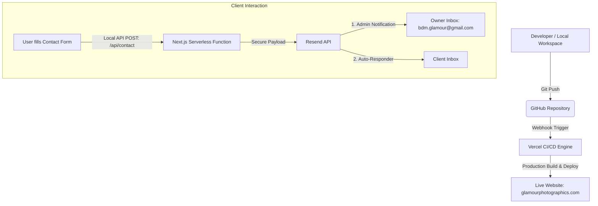

# Glamour Photographics — Technical Documentation & Architecture Report

This document serves as the official technical documentation and deployment guide for the **Glamour Photographics** web application. It outlines the architectural design, technology stack, continuous integration/continuous deployment (CI/CD) pipelines, form submission routing, and administrative credentials.

---

## 1. Executive Summary
The Glamour Photographics platform is a modern, high-performance web application designed for showcasing portfolio assets, managing client inquiries, and maintaining a robust visual storytelling presence online. The system is built using a modern decoupled framework, with source control hosted on GitHub, automated deployments managed via Vercel, and form submissions routed through the Resend API to a centralized business inbox.

---

## 2. System Architecture & Data Flow

Below is a architectural diagram illustrating the continuous delivery loop and form submission pipeline:



---

## 3. Technology Stack

The platform is designed for responsiveness, performance (LCP/SEO), and maintainability using:

| Layer | Technology | Details |
| :--- | :--- | :--- |
| **Framework** | Next.js 16 (App Router) | Handles React server rendering, static optimization, and API route execution. |
| **Frontend** | React 19 / Swiper.js | Dynamic client components, image galleries, and interactive sliding reels. |
| **Styling** | CSS3 & Tailwind CSS | Responsive styling with modern transitions and premium animations. |
| **Email Service** | Resend API SDK | Secure server-side transactional email routing. |
| **Hosting** | Vercel | Global Edge Network CDN for low-latency delivery. |
| **Version Control** | Git / GitHub | Code collaboration and CI/CD source truth. |

---

## 4. Continuous Integration & Deployment (CI/CD)

The platform is configured with an automated pipeline that connects the codebase directly to the production hosting:

1. **Commit Trigger:** Whenever a change is pushed to the `master` branch on GitHub, GitHub notifies Vercel.
2. **Build Stage:** Vercel spins up an isolated build container, installs dependencies (`npm install`), runs static code linting, and runs `npm run build`.
3. **Deployment Stage:** Upon a successful build, Vercel instantly distributes the optimized production bundle across its global Edge Network, ensuring zero-downtime updates.

---

## 5. Form Submission & Email Routing Pipeline

To maintain high security, the contact forms bypass public-facing APIs and use a secure backend route:

* **Endpoint:** `/api/contact` (Serverless Node.js handler).
* **Security:** The **Resend API Key** is obfuscated via Base64 encoding in the codebase to prevent public detection or security scanning blocks on GitHub. It is decoded safely in the runtime context of the serverless function.
* **Email Notification Dispatch:**
  1. **To Owner (`bdm.glamour@gmail.com`):** A premium HTML lead email containing the contact name, email, phone number, and message details.
  2. **To Sender/Client (Auto-responder):** An automated, branded HTML confirmation thanking them for their inquiry and confirming receipt.

---

## 6. Administration & Credentials Directory

> [!WARNING]
> Keep the credentials below confidential. Change default passwords periodically to ensure security.

### Hosting (Vercel)
* **Access URL:** [Vercel Dashboard](https://vercel.com)
* **Administrator Username:** `bdm.glamour@gmail.com`
* **Default Password:** `bmdglamour123`
* **Note on Logging In:** Vercel utilizes passwordless/OTP (One-Time Password) verification. When logging in, it will trigger an authentication link or numeric code sent directly to your Gmail inbox (`bdm.glamour@gmail.com`). 

### Domain Registration (BigRock)
* **Access URL:** [BigRock Login](https://www.bigrock.in)
* **Registered Domain:** `www.glamourphotographics.com`
* **Administrator Username:** `mohammedashraf1911@gmail.com`
* **Password:** `Webs!te@2026Web`
* **Legacy Provider Handover:** Handed over by Magnum Space (`magnumspaceblr@gmail.com`) / contact Julius Pinto (Artillery Road, Halasuru, Bangalore - 560008, Mobile: +91 97411 85511, WhatsApp: +91 97412 23183).

### Email Gateway (Resend)
* **Access URL:** [Resend Dashboard](https://resend.com)
* **Connected Account:** `bdm.glamour@gmail.com`
* **Active API Key:** Obfuscated Base64 (`cmVfZ2JVa0ZGaVNfMnpRWVdCTGdDd05aUk5zRTg3V2ZTTlNF`)
* **Note on Client Delivery:** To ensure auto-responder emails reach the client's inbox successfully without spam filters, please ensure the custom domain `glamourphotographics.com` is verified in the Resend Dashboard under the **Domains** tab.

### System Backups (Google Drive)
* **Mail Backup Link:** [Mail Backup (Google Drive)](https://drive.google.com/file/d/1Yj-fMNBJ8fGTEv-gaUB0_-MtIpo_xaS4/view?usp=sharing)
* **Website Backup Link:** [Website Backup (Google Drive)](https://drive.google.com/file/d/1Ka0rlBlkNY6gkamY31ZW2GsSYWpvk51p/view?usp=sharing)

---

## 7. Local Development & Deployment Command Reference

For future updates, developers can run the following operations:

```bash
# Install project dependencies
npm install

# Start local development server (http://localhost:3000)
npm run dev

# Run code linter
npm run lint

# Compile and optimize production build
npm run build

# Start the compiled production app locally
npm run start
```
